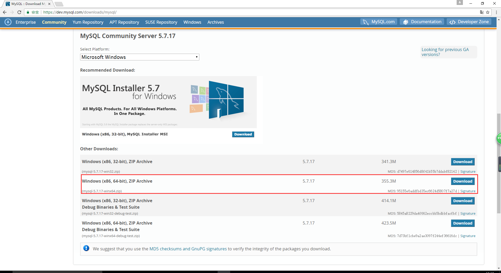
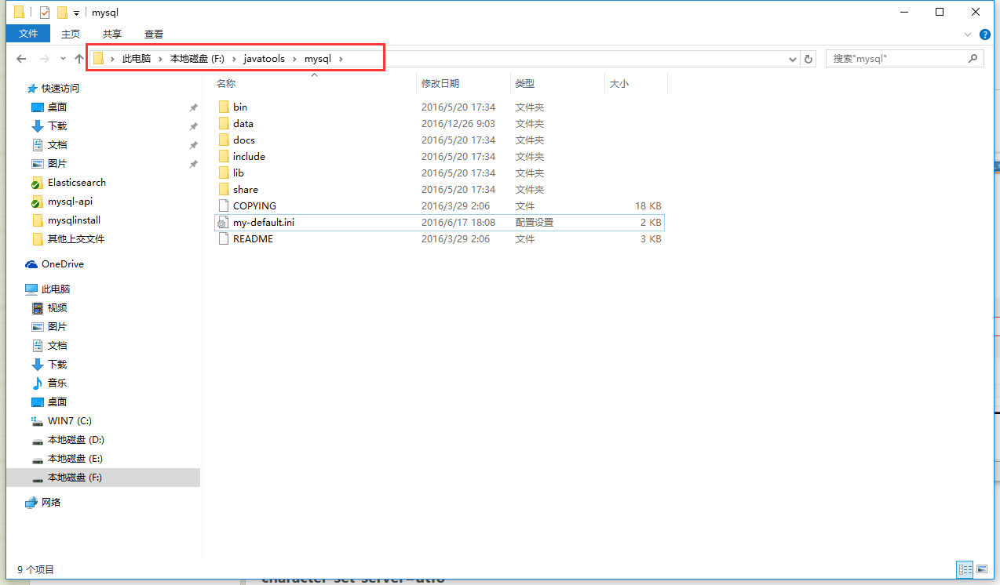
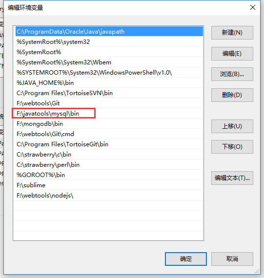
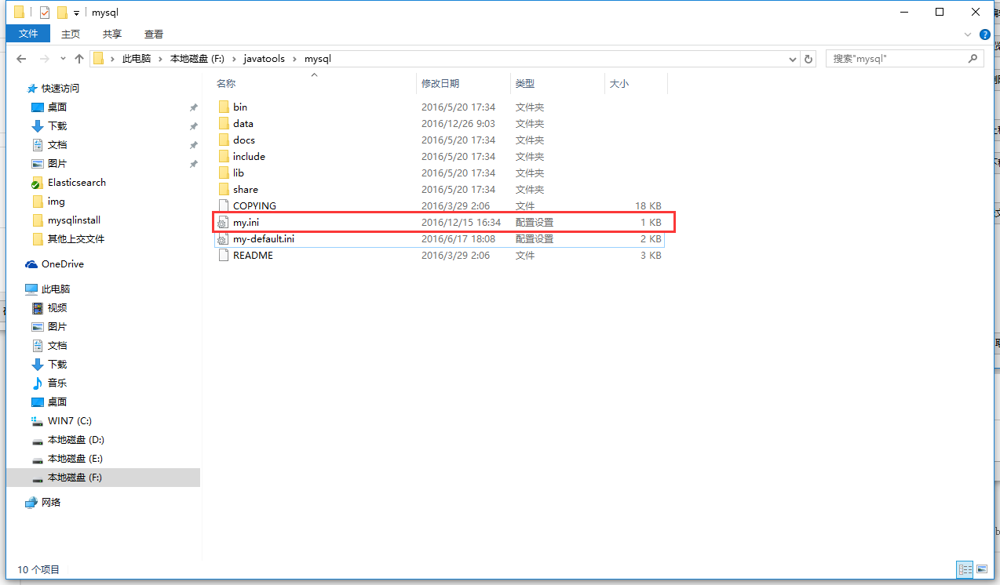
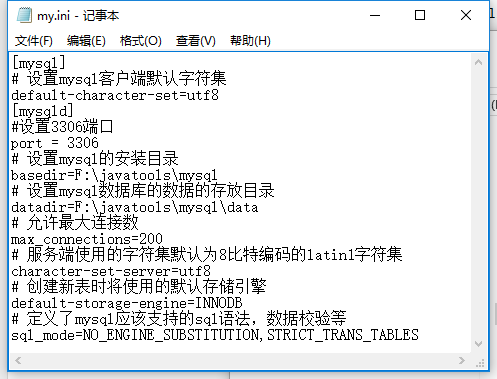
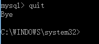
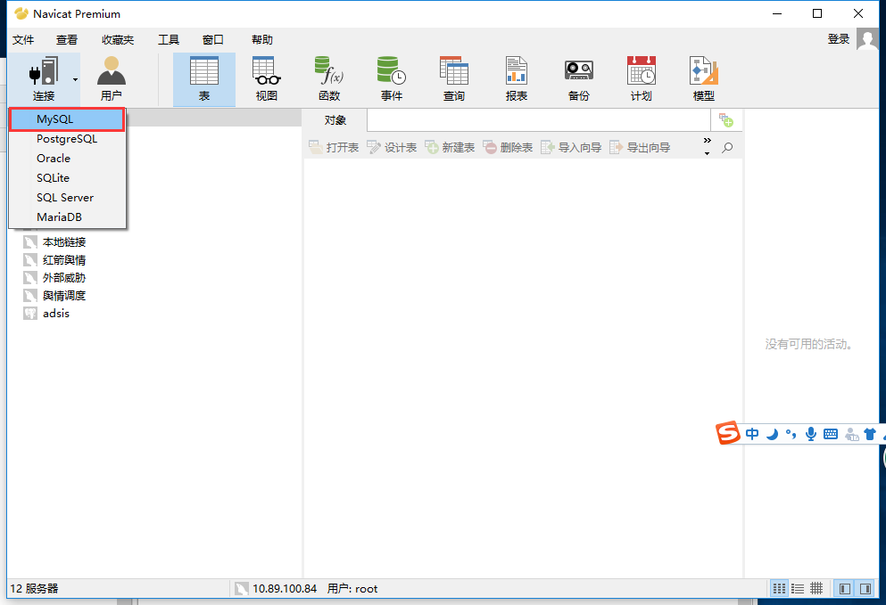
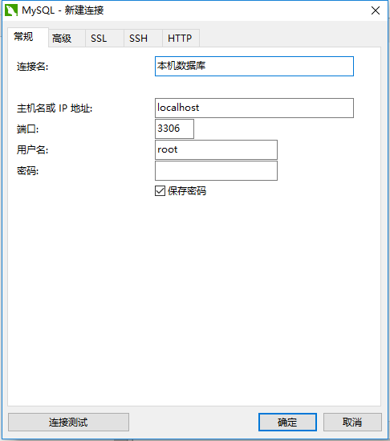

# mysql 安装教程
本教程讲解最简单的mysql安装教程。
## 下载压缩包
[压缩包下载地址](https://dev.mysql.com/downloads/mysql/)

** 注意：根据自己电脑的位数选择下载32位或者64位 **


## 解压到相应文件夹中
本人是解压到F:\javatools文件夹下，并将文件夹名字改为了mysql。



## 配置环境变量
配置环境变量，在path中放入：F:\javatools\mysql\bin;


## 增加配置文件
复制一份my-default.ini文件出来并重命名为my.ini

具体配置为如下：
```
	[mysql]
	# 设置mysql客户端默认字符集
	default-character-set=utf8 
	[mysqld]
	#设置3306端口
	port = 3306 
	# 设置mysql的安装目录
	basedir=F:\javatools\mysql
	# 设置mysql数据库的数据的存放目录
	datadir=F:\javatools\mysql\data
	# 允许最大连接数
	max_connections=200
	# 服务端使用的字符集默认为8比特编码的latin1字符集
	character-set-server=utf8
	# 创建新表时将使用的默认存储引擎
	default-storage-engine=INNODB 
	# 定义了mysql应该支持的sql语法，数据校验等
	sql_mode=NO_ENGINE_SUBSTITUTION,STRICT_TRANS_TABLES 
```

** 注意：将相关的路径设置为何自己电脑匹配的路径 **

## 进入命令窗口（注意：以管理员身份进入）
### 进入到mysql的bin目录
```
cd F:\javatools\mysql\bin
```

### 初始化数据库
```
命令：mysqld --initialize   #直接初始化mysql，生成data文件夹中的文件。
```

### 安装数据库
```
命令：mysqld -install          #安装mysql
```

### 启动数据库服务
```
命令：net start mysql          #启动服务器
```

## 登录
第一次登录不用输入密码，一路回车往下，就会进入mysql
```
mysql -u root -p
```
## 退出
在mysql中输入quit，然后回车
```
mysql>quit
```


## mysql图形化界面安装
本次我们安装的图形化界面为Navicat Premium

## 下载Navicat Premium
[Navicat Premium下载地址](http://pan.baidu.com/s/1hsHT4Ug)
提取码： ygra
接下来和其他游戏安装一抹一样，一直下一步。

## 用Navicat Premium链接数据库


链接测试成功后，既可连入数据库。