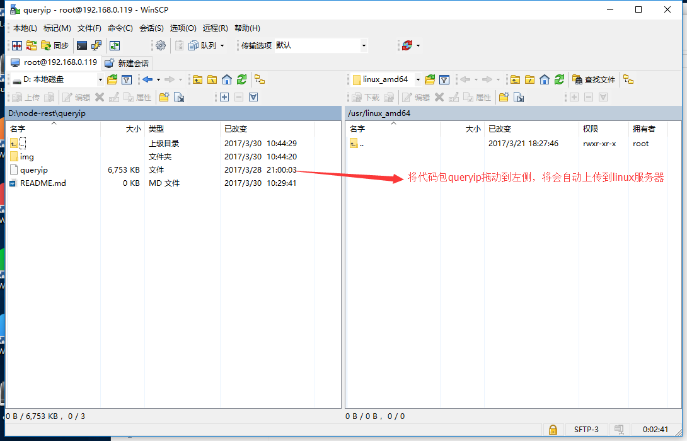
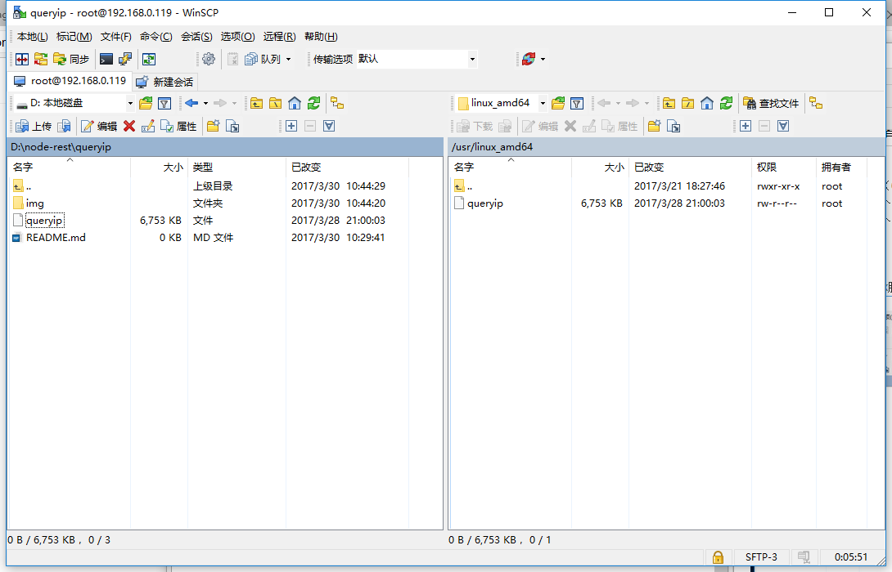
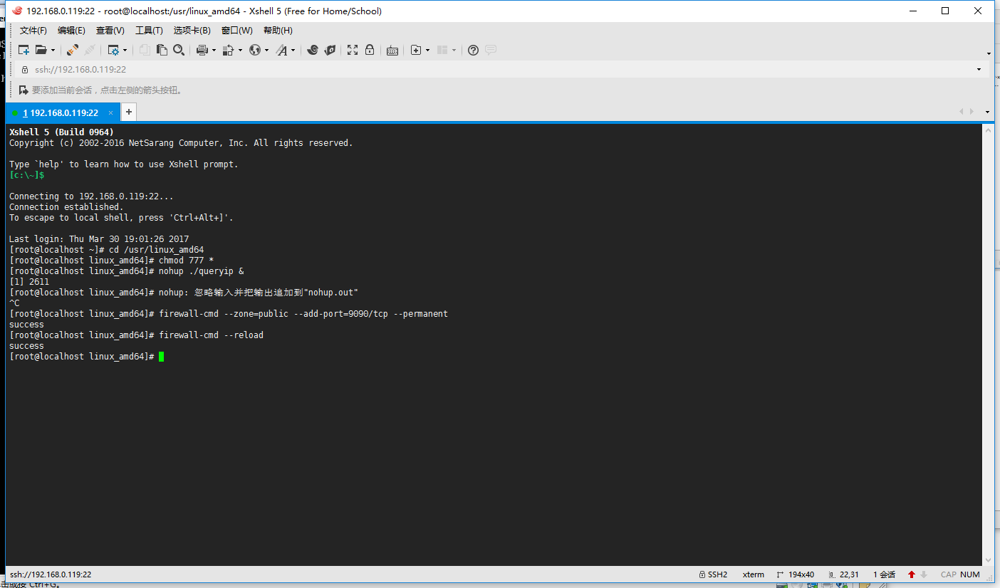
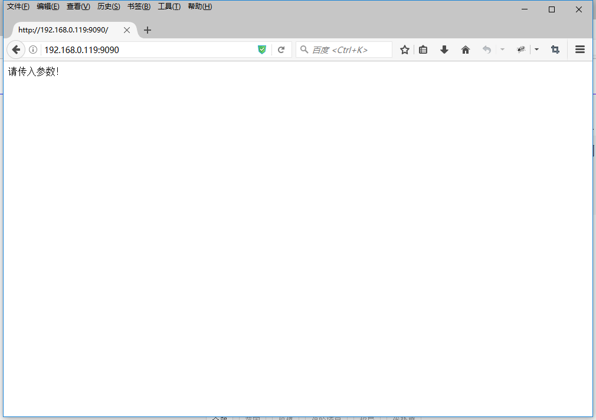

#ip定位系统

##linux系统下部署指南
* 准备工作
	* 记事本（或其他纯文本编辑器）
	* linux服务器一台（64位）
	* 文件传输工具一个（winftp）
	* 远程命令工具一个（xshell）

### 配置文件设置
打开conf.toml 将server username password dataname修改为目标参数

### 文件传输
将写好的代码，传输到linux服务器（路径自己定义，在本例子中以`/usr/linux_amd64`为示例路径）。

### xshell链接linux启动服务
* 启动流程
	* `cd /usr/linux_amd64`
	* `chmod 777 *`
	* `nohup ./queryip &`
* 开放9090端口（centos7）
	* `firewall-cmd --zone=public --add-port=9090/tcp --permanent`
	* `firewall-cmd --reload`

### 在浏览器中测试，是否启动完成
浏览器地址栏输入`您的ip`:9090如果出现`请传入参数！`表示启动成功！
