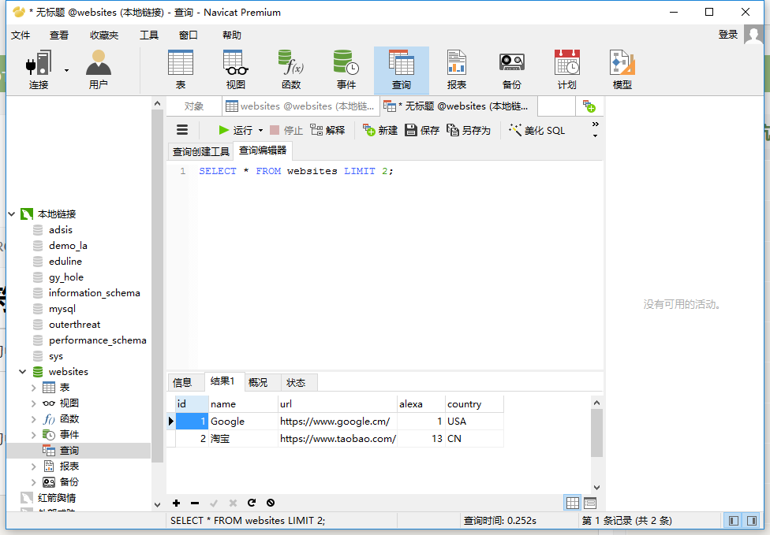
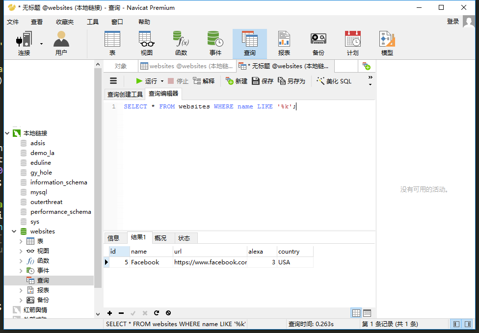
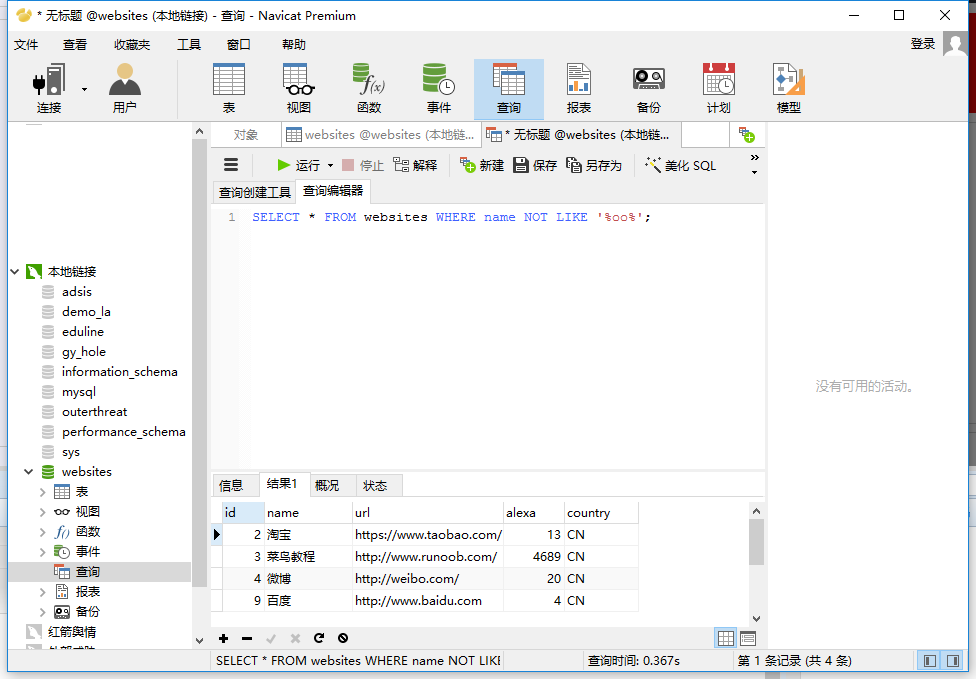
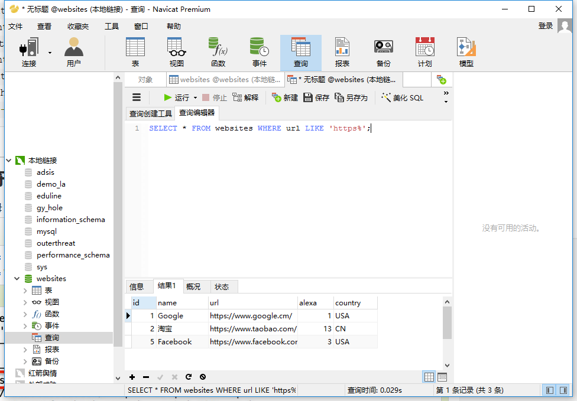
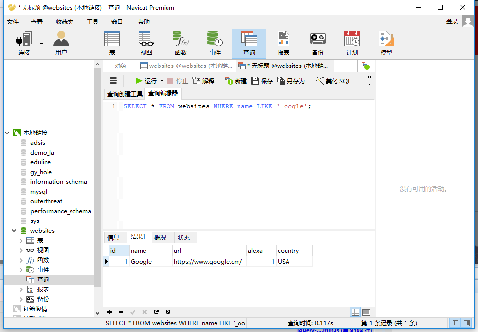
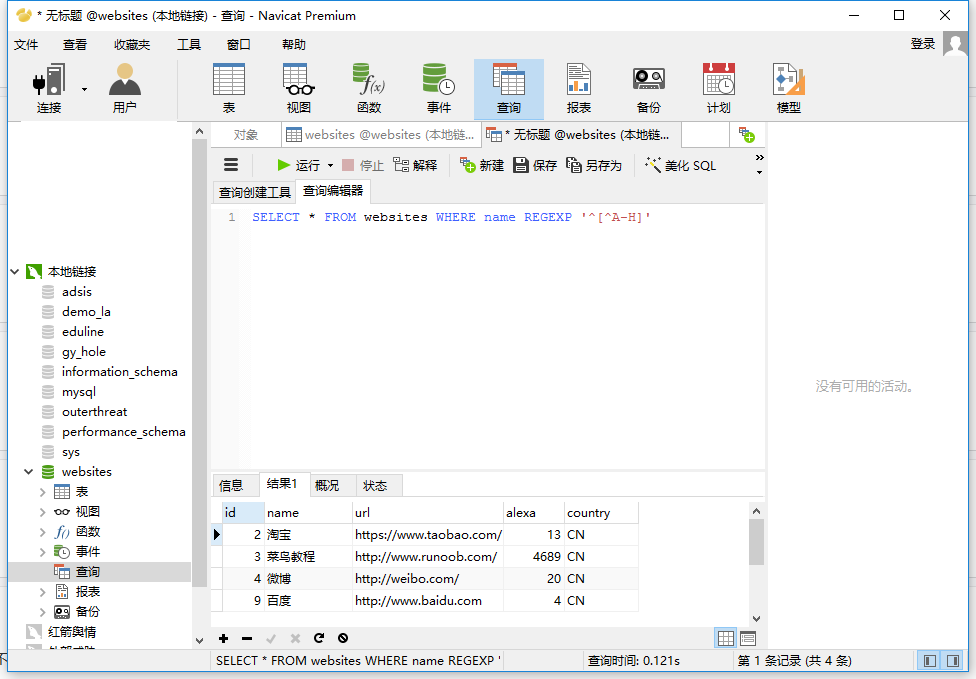
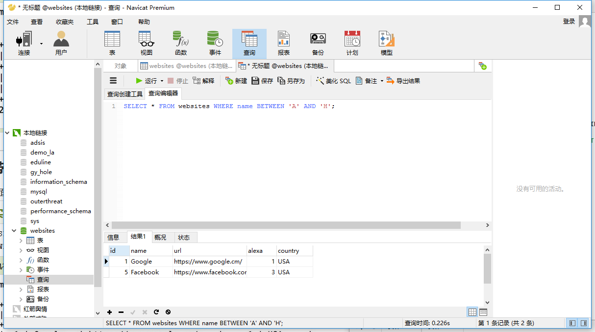
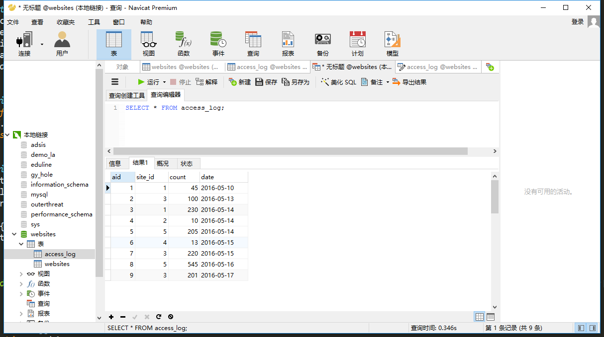

# SQL简介
	SQL 是用于访问和处理数据库的标准的计算机语言。
    SQL，指结构化查询语言，全称是 Structured Query Language。
    SQL 让您可以访问和处理数据库。
    SQL 是一种 ANSI（American National Standards Institute 美国国家标准化组织）标准的计算机语言。

## SQL能做什么

    SQL 面向数据库执行查询
    SQL 可从数据库取回数据
    SQL 可在数据库中插入新的记录
    SQL 可更新数据库中的数据
    SQL 可从数据库删除记录
    SQL 可创建新数据库
    SQL 可在数据库中创建新表
    SQL 可在数据库中创建存储过程
    SQL 可在数据库中创建视图
    SQL 可以设置表、存储过程和视图的权限

## SQL 是一种标准 - 但是...
虽然 SQL 是一门 ANSI（American National Standards Institute 美国国家标准化组织）标准的计算机语言，但是仍然存在着多种不同版本的 SQL 语言。

然而，为了与 ANSI 标准相兼容，它们必须以相似的方式共同地来支持一些主要的命令（比如 SELECT、UPDATE、DELETE、INSERT、WHERE 等等）。

## 本教程使用的sql文件
[websites](file/websites.sql)
[access_log](access_log/websites.sql)
## 在您的网站中使用 SQL
1.数据库
2.SQL（入库）
3.server（服务器语言）
4.html/css
##　RDBMS
RDBMS 指关系型数据库管理系统，全称 Relational Database Management System。

RDBMS 是 SQL 的基础，同样也是所有现代数据库系统的基础，比如 MS SQL Server、IBM DB2、Oracle、MySQL 以及 Microsoft Access。

RDBMS 中的数据存储在被称为表的数据库对象中。

表是相关的数据项的集合，它由列和行组成。

# SQL语法
## 数据库表
一个数据库通常包含一个或多个表。每个表由一个名字标识（例如:"Websites"）,表包含带有数据的记录（行）。

在本教程中，我们在 MySQL 的 RUNOOB 数据库中中创建了 Websites 表，用于存储网站记录。

## SQL 语句
您需要在数据库上执行的大部分工作都由 SQL 语句完成。

下面的 SQL 语句从 "Websites" 表中选取所有记录：
```
SELECT＊FROM　Websites;
```
*请注意：SQL对大小写不敏感，SELECT与SELECT是相同的。*

## SQL语句后面的分号？
有些数据库要求SQL语句末端用分号。
分号是每条sql的标准分法。

## 一些重要的SQL命令
- SELECT-从数据库中提取数据
- UPDATE-更新数据库中的数据
- DELETE-删除数据库中数据
- INSERTINTO-向数据库中插入新数据
- CREATEDATABALE-创建新数据库
- ALTERDATABALE-变更（修改）数据库
- DROPTABLE-删除表
- CREATEINDEX-创建索引（搜索键）
- DROP INDEX-删除索引

# SQLSELECT语句
SELECT 语句用于从数据库中选取数据。

## SQL SELECT 语句
SELECT 语句用于从数据库中选取数据。

结果被存储在一个结果表中，称为结果集。

## SQL SELECT 语法
```
SELECT cloumn_name,cloumn_name FROM table-name;

SELECT * FORM table_name;
```

## 演示数据库 
本教程，我们将使用Websites表的数据，数据库连接工具，我们用的是Navicat Premium，下面是Websites表的数据


## SELECT Column 实例
下面的 SQL 语句从 "Websites" 表中选取 "name" 和 "country" 列：
```
SELECT name,country FROM websites
```


## SELECT * 实例
下面的 SQL 语句从 "Websites" 表中选取所有列：
```
SELECT * websites
```


## 结果集中的导航
大多数数据库软件系统都允许使用编程函数在结果集中进行导航，比如：Move-To-First-Record、Get-Record-Content、Move-To-Next-Record 等等。
(注解：相当于在表中建立一个游标，指定是第几行的数据。)
参考链接：[jbdc实例](http://www.yiibai.com/jdbc/navigate-result-sets.html)
[详情参考](http://wiki.jikexueyuan.com/project/jdbc/result-sets.html)

# SQL SELECT DISTINCT 语句
SELECT DISTINCT 语句用于返回唯一不同的值。
## SQL SELECT DISTINCT 语句
在表中，一个列可能会包含多个重复值，有时您也许希望仅仅列出不同（distinct）的值。

DISTINCT 关键词用于返回唯一不同的值。

## SQL SELECT DISTINCT 语法
```
SELECT DISTINCT column_name,colunm FROM table_name
```

## SELECT DISTINCT 实例
下面的 SQL 语句仅从 "Websites" 表的 "country" 列中选取唯一不同的值，也就是去掉 "country" 列重复值：
```
SELECT DISTINCT country FROM websites
```


# SQL WHERE 子句
WHERE 子句用于过滤记录。

## SQL WHERE 语法
```
SELECT column_name,column_name FROM table_name FROM column_name operator value
```

## 示例演示
```
SELECT * FROM websites WHERE country="CN"
```


## 文本字段 vs. 数值字段
sql使用单引号来环绕文本值（大部分的数据库系统也支持双引号）。
在上个实例中‘CN’文本字段使用了单引号。
如果是数值，请不要使用引号。
实例
```
SELECT * FROM websites WHERE id=1;
```


## WHERE 子句中的运算符
下面的运算符可以在 WHERE 子句中使用：

- =	等于
- <>	不等于。注释：在 SQL 的一些版本中，该操作符可被写成 !=
- >	大于
- <	小于
- >=	大于等于
- <=	小于等于
- BETWEEN	在某个范围内
- LIKE	搜索某种模式
- IN	指定针对某个列的多个可能值

# SQL AND & OR 运算符
AND & OR 运算符用于基于一个以上的条件对记录进行过滤。

如果第一个条件和第二个条件都成立，则 AND 运算符显示一条记录。
如果第一个条件和第二个条件中只要有一个成立，则 OR 运算符显示一条记录。

## AND 运算符实例
下面的 SQL 语句从 "Websites" 表中选取国家为 "CN" 且alexa排名大于 "50" 的所有网站：
示例
```
SELECT * FROM websites WHERE country='CN' AND alexa>50;
```


## OR运算实例
```
SELECT * FROM websites WHERE country='CN' OR country='USA';
```


## 结合 AND & OR
您也可以把 AND 和 OR 结合起来（使用圆括号来组成复杂的表达式）。
下面的 SQL 语句从 "Websites" 表中选取 alexa 排名大于 "15" 且国家为 "CN" 或 "USA" 的所有网站：
```
SELECT * FROM websites WHERE alexa>15 AND (country='USA' OR country='CN');
```


# SQL ORDER BY 关键字
ORDER BY 关键字用于对结果集进行排序。
ORDER BY 关键字用于对结果集按照一个列或者多个列进行排序。
ORDER BY 关键字默认按照升序对记录进行排序。如果需要按照降序对记录进行排序，您可以使用 DESC 关键字。

## SQL ORDER BY 语法
```
SELECT column_name,column_name FROM table_name ORDER BY column_name,column_name ASC|DESC;
```

## ORDER BY 实例
下面的 SQL 语句从 "Websites" 表中选取所有网站，并按照 "alexa" 列排序：
示例：
```
SELECT * FROM websites ORDER BY alexa ASC;
```


## ORDER BY DESC 实例
下面的 SQL 语句从 "Websites" 表中选取所有网站，并按照 "alexa" 列降序排序：
```
SELECT * FROM websites ORDER BY alexa DESC;
```


## ORDER BY 多列
下面的 SQL 语句从 "Websites" 表中选取所有网站，并按照 "country" 和 "alexa" 列排序：
```
```
（理解：先是根据国家排序，排完然后在国家中再根据排名排序）


# SQL INSERT INTO 语句
INSERT INTO 语句用于向表中插入新记录。

## SQL INSERT INTO 语法
INSERT INTO 语句可以有两种编写形式。
第一种形式无需指定要插入数据的列名，只需提供被插入的值即可：
```
INSERT INTO table-name VALUES (value1,value2.…);
```
第二种形式需要指定列名及被插入的值：
```
INSERT INTO table_name (column1,column2,…) VALUES (value1,value2,value3,…);
```

## 插入实例
```
INSERT INTO websites (name,url,alexa,country) VALUES ('百度','http://www.baidu.com','4','CN');
```

** 注意当不指定列明的时候，插入的数据项的长度必须与列的长度相等！

## 在指定的列插入数据
我们也可以在指定的列插入数据。
下面的 SQL 语句将插入一个新行，但是只在 "name"、"url" 和 "country" 列插入数据（id 字段会自动更新）：
```
INSERT INTO websites (name,url,country) VALUES ('晓军博客','http://www.wangxiaojun.top','CN');
```


# SQL UPDATE 语句
UPDATE 语句用于更新表中已存在的记录。

## sql update 语法

```
UPDATE table_name SET column1=value1,column2=value2,… WHERE some_column=somoe_value;
```
** 注意：请注意 SQL UPDATE 语句中的 WHERE 子句！
WHERE 子句规定哪条记录或者哪些记录需要更新。如果您省略了 WHERE 子句，所有的记录都将被更新！

## 实例
假设我们要把 "晓军博客" 的 alexa 排名更新为 5000，country 改为 USA。
我们使用下面的 SQL 语句：
```
UPDATE websites SET alexa='5000', country='USA' WHERE name='晓军博客';
```


**　注意：在更新记录时要格外小心！在上面的实例中，如果我们省略了 WHERE 子句，如下所示：
```
UPDATE Websites
SET alexa='5000', country='USA'
```
执行以上代码会将 Websites 表中所有数据的 alexa 改为 5000，country 改为 USA。
执行没有 WHERE 子句的 UPDATE 要慎重，再慎重。

# SQL DELETE 语句
DELETE 语句用于删除表中的记录。

## SQL DELETE 语法
```
DELETE FROM table_name WHERE some_column=some_value;
```
**　注意：请注意 SQL DELETE 语句中的 WHERE 子句！
WHERE 子句规定哪条记录或者哪些记录需要删除。如果您省略了 WHERE 子句，所有的记录都将被删除！

## 实例
假设我们要从 "Websites" 表中删除网站名为 "百度" 且国家为 CN 的网站 。
我们使用下面的 SQL 语句：

```
DELETE FROM websites WHERE name='百度' AND country='CN';
```


## 删除所有数据
您可以在不删除表的情况下，删除表中所有的行。这意味着表结构、属性、索引将保持不变：
```
DELETE FROM table_name；或者
DELETE * FROM table_name;
```
** 注意：在删除记录时要格外小心，因为您不能重来！

# SQL SELECT TOP, LIMIT, ROWNUM 子句
## SQL SELECT TOP 子句
SELECT TOP 子句用于规定要返回的记录的数目。
SELECT TOP 子句对于拥有数千条记录的大型表来说，是非常有用的。
** 注意：并非所有的数据库系统都支持 SELECT TOP 子句。

## 实例(mysql)
```
SELECT * FROM websites LIMIT 2;
```


|| 理解：这个语法，就是是返回规定已经数目的集合，有三种是因为不同的数据库所用的语法不一样！

# SQL LIKE 操作符
LIKE 操作符用于在 WHERE 子句中搜索列中的指定模式。

## SQL like 语法
```
SELECT column_name FROM table_name WHERE column_name LIKE pattern;
```

## SQL LIKE 操作符实例
下面的 SQL 语句选取 name 以字母 "G" 开始的所有客户：
```
SELECT * FROM websites WHERE name LIKE 'G%';
```


|| 提示："%" 符号用于在模式的前后定义通配符（缺省字母）。您将在下一章中学习更多有关通配符的知识。

下面的 SQL 语句选取 name 以字母 "k" 结尾的所有客户：
```
SELECT * FROM websites WHERE name LIKE '%k';
```


下面的 SQL 语句选取 name 包含模式 "oo" 的所有客户：
```
SELECT * FROM websites WHERE name LIKE '%oo%';
```


通过使用 NOT 关键字，您可以选取不匹配模式的记录。

下面的 SQL 语句选取 name 不包含模式 "oo" 的所有客户：
```
SELECT * FROM websites WHERE name NOT LIKE '%oo%';
```


# SQL 通配符
通配符可用于替代字符串中的任何其他字符。
在 SQL 中，通配符与 SQL LIKE 操作符一起使用。

SQL 通配符用于搜索表中的数据。

在 SQL 中，可使用以下通配符：
- 
- % 	替代 0 个或多个字符
- _ 	替代一个字符
- [charlist] 	字符列中的任何单一字符
- [^charlist]或[!charlist] 	不在字符列中的任何单一字符

##　使用 SQL % 通配符
下面的 SQL 语句选取 url 以字母 "https" 开始的所有网站：
实例：
```
SELECT * FROM websites WHERE url LIKE 'https%';
```


## 使用 SQL _ 通配符
下面的 SQL 语句选取 name 以一个任意字符开始，然后是 "oogle" 的所有客户：
```
SELECT * FROM websites WHERE name LIKE '_oogle';
```

下面的 SQL 语句选取 name 以 "G" 开始，然后是一个任意字符，然后是 "o"，然后是一个任意字符，然后是 "le" 的所有网站：
```
SELECT * FROM websites WHERE name LIKE 'G_o_le';
```


## 使用 SQL [charlist] 通配符
MySQL 中使用 REGEXP 或 NOT REGEXP 运算符 (或 RLIKE 和 NOT RLIKE) 来操作正则表达式。

下面的 SQL 语句选取 name 以 "G"、"F" 或 "s" 开始的所有网站：
```
SELECT * FROM websites WHERE name REGEXP '^[GFs]';
```


下面的 SQL 语句选取 name 以 A 到 H 字母开头的网站：
```
SELECT * FROM websites WHERE name REGEXP '^[A-H]';
```


下面的 SQL 语句选取 name 不以 A 到 H 字母开头的网站：
```
SELECT * FROM websites WHERE name REGEXP '^[^A-H]'
```


# IN 操作符
IN 操作符允许您在 WHERE 子句中规定多个值。

sql in 语法
```
SELECT column_name FROM teble_name WHERE column_name IN （value1，value2,…);
```

## 实例
```
SELECT * FROM websites WHERE name IN ('Google','晓军博客');
```


# SQL BETWEEN 操作符
BETWEEN 操作符用于选取介于两个值之间的数据范围内的值。
BETWEEN 操作符选取介于两个值之间的数据范围内的值。这些值可以是数值、文本或者日期。
## SQL BETWEEN 语法
```
SELECT column_name FROM table_name WHERE column_name BETWEEN value1 AND value2;
```

## 实例
下面的 SQL 语句选取 alexa 介于 1 和 20 之间的所有网站：
```
SELECT * FROM websites WHERE alexa BETWEEN '1' AND '20';
```


## NOT BETWEEN 操作符实例
选择不在1到20之间的
```
SELECT * FROM websites WHERE alexa NOT BETWEEN 1 AND 20;
```


## 带有 IN 的 BETWEEN 操作符实例
下面的 SQL 语句选取alexa介于 1 和 20 之间但 country 不为 USA 和 IND 的所有网站：
```
SELECT * FROM websites WHERE (alexa BETWEEN 1 AND 20) AND NOT country IN ('USA','IND');
```


## 带有文本值的 BETWEEN 操作符实例
下面的 SQL 语句选取 name 以介于 'A' 和 'H' 之间字母开始的所有网站：
```
SELECT * FROM websites WHERE name BETWEEN 'A' AND 'H';
```

** 注意：首字母！！匹配首字母！！

## 带有文本值的 NOT BETWEEN 操作符实例
```
SELECT * FROM websites WHERE name NOT BETWEEN 'A' AND 'H';
```


## 示例表
下面是 "access_log" 网站访问记录表的数据，其中：
aid：为自增 id。
site_id：为对应 websites表的网站 id。
count：访问次数。
date：为访问日期。


## 带有日期值的 BETWEEN 操作符实例
下面的 SQL 语句选取 date 介于 '2016-05-10' 和 '2016-05-14' 之间的所有访问记录：
```
SELECT * FROM access_log WHERE date BETWEEN '2016-05-10' AND '2016-05-14';
```

** 注意：请注意，在不同的数据库中，BETWEEN 操作符会产生不同的结果！
在某些数据库中，BETWEEN 选取介于两个值之间但不包括两个测试值的字段。
在某些数据库中，BETWEEN 选取介于两个值之间且包括两个测试值的字段。
在某些数据库中，BETWEEN 选取介于两个值之间且包括第一个测试值但不包括最后一个测试值的字段。

因此，请检查您的数据库是如何处理 BETWEEN 操作符！

# SQL 别名
通过使用 SQL，可以为表名称或列名称指定别名。

基本上，创建别名是为了让列名称的可读性更强。

## 列的 SQL 别名语法
```
SELECT column_name AS alias_name FROM table_name;
```

## 表的sql别名语法
```
SELECT column_name FROM table_name AS alias_name;
```

## 列别名实例
下面的 SQL 语句指定了两个别名，一个是 name 列的别名，一个是 country 列的别名。提示：如果列名称包含空格，要求使用双引号或方括号：