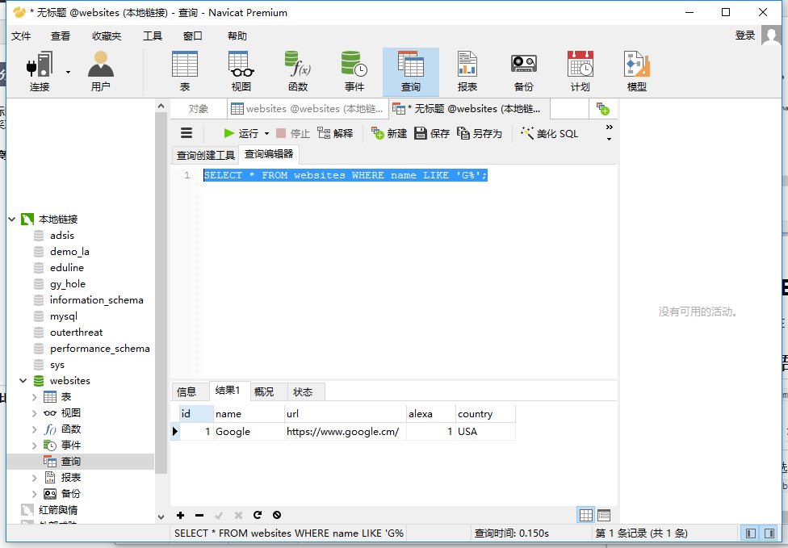
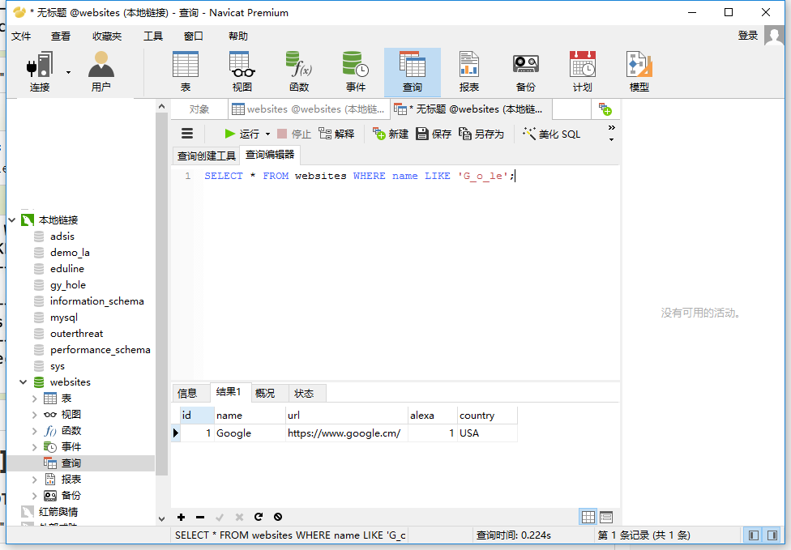
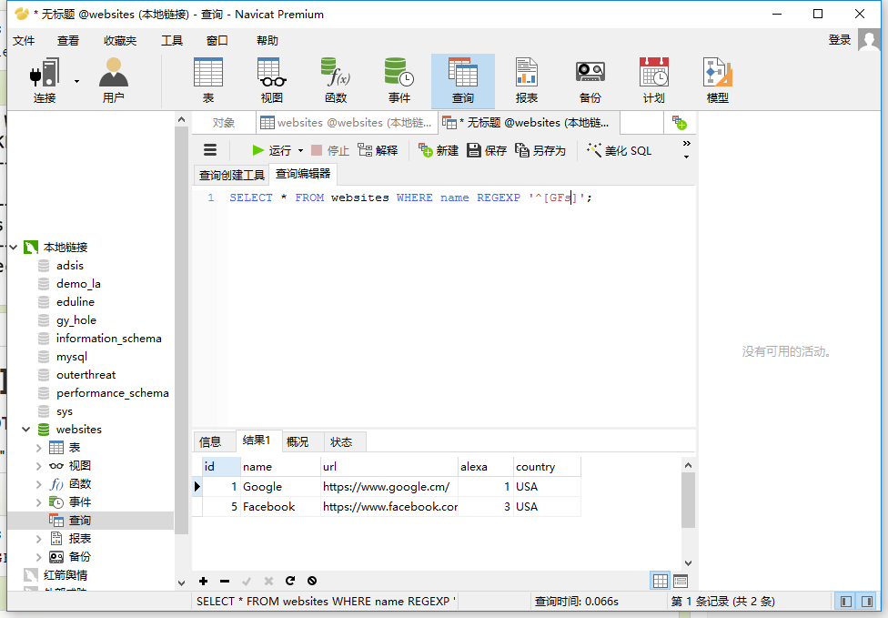
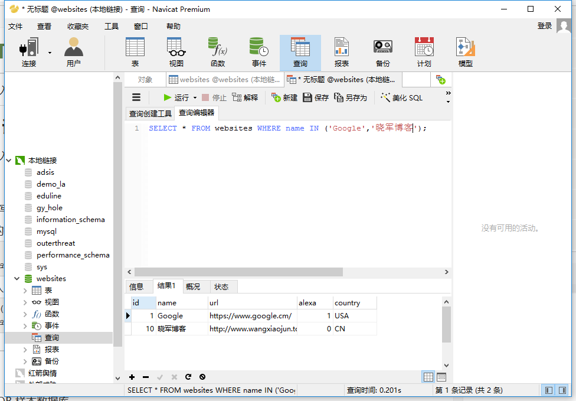
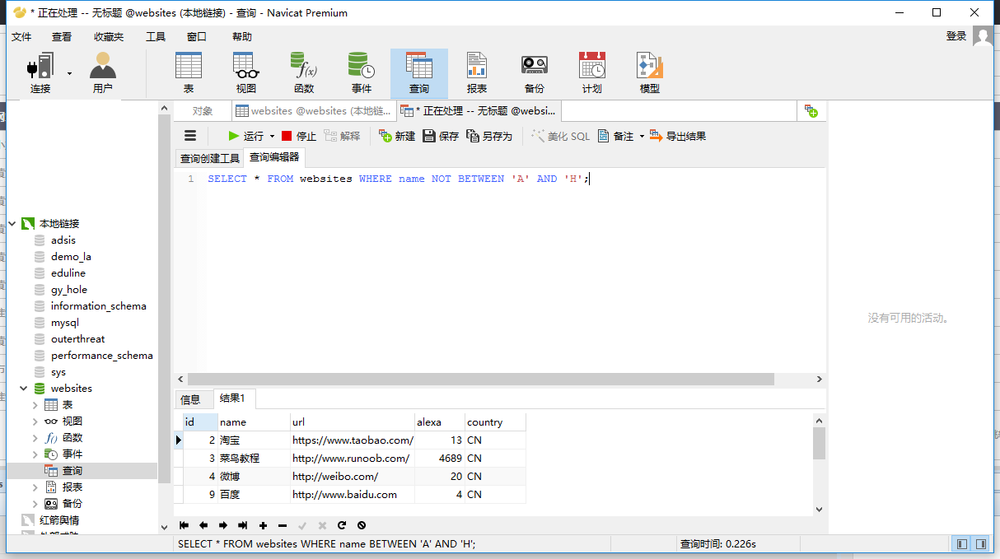
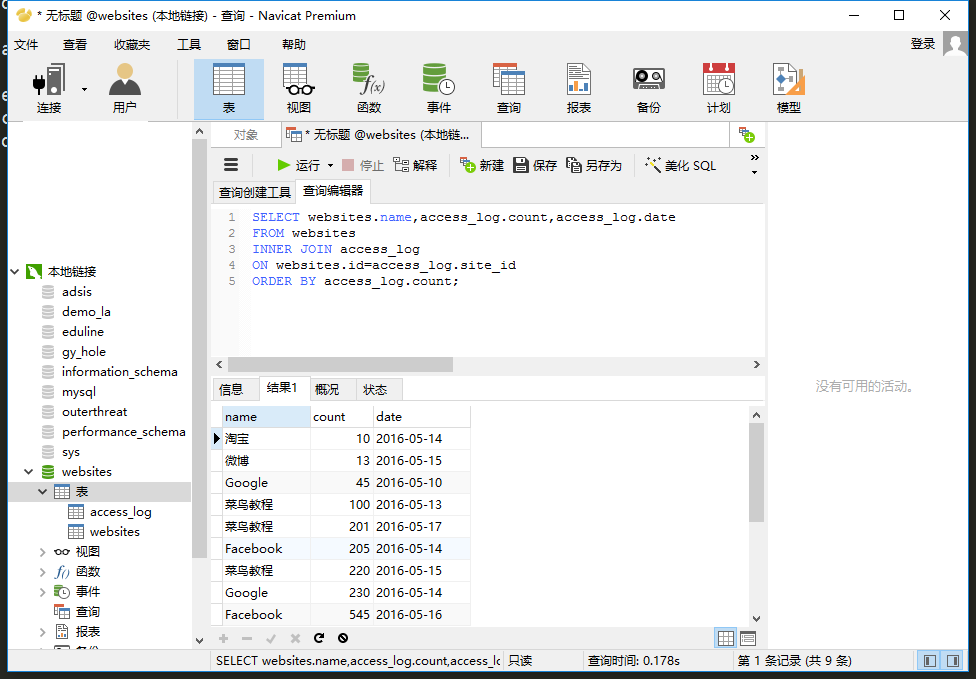

# SQL简介
	SQL 是用于访问和处理数据库的标准的计算机语言。
    SQL，指结构化查询语言，全称是 Structured Query Language。
    SQL 让您可以访问和处理数据库。
    SQL 是一种 ANSI（American National Standards Institute 美国国家标准化组织）标准的计算机语言。

## SQL能做什么

    SQL 面向数据库执行查询
    SQL 可从数据库取回数据
    SQL 可在数据库中插入新的记录
    SQL 可更新数据库中的数据
    SQL 可从数据库删除记录
    SQL 可创建新数据库
    SQL 可在数据库中创建新表
    SQL 可在数据库中创建存储过程
    SQL 可在数据库中创建视图
    SQL 可以设置表、存储过程和视图的权限

## SQL 是一种标准 - 但是...
虽然 SQL 是一门 ANSI（American National Standards Institute 美国国家标准化组织）标准的计算机语言，但是仍然存在着多种不同版本的 SQL 语言。

然而，为了与 ANSI 标准相兼容，它们必须以相似的方式共同地来支持一些主要的命令（比如 SELECT、UPDATE、DELETE、INSERT、WHERE 等等）。

## 本教程使用的sql文件
[websites](file/websites.sql)
[access_log](file/access_log.sql)
[apps](file/apps.sql)
## 在您的网站中使用 SQL
1.数据库
2.SQL（入库）
3.server（服务器语言）
4.html/css
##　RDBMS
RDBMS 指关系型数据库管理系统，全称 Relational Database Management System。

RDBMS 是 SQL 的基础，同样也是所有现代数据库系统的基础，比如 MS SQL Server、IBM DB2、Oracle、MySQL 以及 Microsoft Access。

RDBMS 中的数据存储在被称为表的数据库对象中。

表是相关的数据项的集合，它由列和行组成。

# SQL语法
## 数据库表
一个数据库通常包含一个或多个表。每个表由一个名字标识（例如:"Websites"）,表包含带有数据的记录（行）。

在本教程中，我们在 MySQL 的 RUNOOB 数据库中中创建了 Websites 表，用于存储网站记录。

## SQL 语句
您需要在数据库上执行的大部分工作都由 SQL 语句完成。

下面的 SQL 语句从 "Websites" 表中选取所有记录：
```
SELECT＊FROM　Websites;
```
*请注意：SQL对大小写不敏感，SELECT与SELECT是相同的。*

## SQL语句后面的分号？
有些数据库要求SQL语句末端用分号。
分号是每条sql的标准分法。

## 一些重要的SQL命令
- SELECT-从数据库中提取数据
- UPDATE-更新数据库中的数据
- DELETE-删除数据库中数据
- INSERTINTO-向数据库中插入新数据
- CREATEDATABALE-创建新数据库
- ALTERDATABALE-变更（修改）数据库
- DROPTABLE-删除表
- CREATEINDEX-创建索引（搜索键）
- DROP INDEX-删除索引

# SQLSELECT语句
SELECT 语句用于从数据库中选取数据。

## SQL SELECT 语句
SELECT 语句用于从数据库中选取数据。

结果被存储在一个结果表中，称为结果集。

## SQL SELECT 语法
```
SELECT cloumn_name,cloumn_name FROM table-name;

SELECT * FORM table_name;
```

## 演示数据库 
本教程，我们将使用Websites表的数据，数据库连接工具，我们用的是Navicat Premium，下面是Websites表的数据


## SELECT Column 实例
下面的 SQL 语句从 "Websites" 表中选取 "name" 和 "country" 列：
```
SELECT name,country FROM websites
```


## SELECT * 实例
下面的 SQL 语句从 "Websites" 表中选取所有列：
```
SELECT * websites
```


## 结果集中的导航
大多数数据库软件系统都允许使用编程函数在结果集中进行导航，比如：Move-To-First-Record、Get-Record-Content、Move-To-Next-Record 等等。
(注解：相当于在表中建立一个游标，指定是第几行的数据。)
参考链接：[jbdc实例](http://www.yiibai.com/jdbc/navigate-result-sets.html)
[详情参考](http://wiki.jikexueyuan.com/project/jdbc/result-sets.html)

# SQL SELECT DISTINCT 语句
SELECT DISTINCT 语句用于返回唯一不同的值。
## SQL SELECT DISTINCT 语句
在表中，一个列可能会包含多个重复值，有时您也许希望仅仅列出不同（distinct）的值。

DISTINCT 关键词用于返回唯一不同的值。

## SQL SELECT DISTINCT 语法
```
SELECT DISTINCT column_name,colunm FROM table_name
```

## SELECT DISTINCT 实例
下面的 SQL 语句仅从 "Websites" 表的 "country" 列中选取唯一不同的值，也就是去掉 "country" 列重复值：
```
SELECT DISTINCT country FROM websites
```


# SQL WHERE 子句
WHERE 子句用于过滤记录。

## SQL WHERE 语法
```
SELECT column_name,column_name FROM table_name FROM column_name operator value
```

## 示例演示
```
SELECT * FROM websites WHERE country="CN"
```


## 文本字段 vs. 数值字段
sql使用单引号来环绕文本值（大部分的数据库系统也支持双引号）。
在上个实例中‘CN’文本字段使用了单引号。
如果是数值，请不要使用引号。
实例
```
SELECT * FROM websites WHERE id=1;
```


## WHERE 子句中的运算符
下面的运算符可以在 WHERE 子句中使用：

- =	等于
- <>	不等于。注释：在 SQL 的一些版本中，该操作符可被写成 !=
- >	大于
- <	小于
- >=	大于等于
- <=	小于等于
- BETWEEN	在某个范围内
- LIKE	搜索某种模式
- IN	指定针对某个列的多个可能值

# SQL AND & OR 运算符
AND & OR 运算符用于基于一个以上的条件对记录进行过滤。

如果第一个条件和第二个条件都成立，则 AND 运算符显示一条记录。
如果第一个条件和第二个条件中只要有一个成立，则 OR 运算符显示一条记录。

## AND 运算符实例
下面的 SQL 语句从 "Websites" 表中选取国家为 "CN" 且alexa排名大于 "50" 的所有网站：
示例
```
SELECT * FROM websites WHERE country='CN' AND alexa>50;
```


## OR运算实例
```
SELECT * FROM websites WHERE country='CN' OR country='USA';
```


## 结合 AND & OR
您也可以把 AND 和 OR 结合起来（使用圆括号来组成复杂的表达式）。
下面的 SQL 语句从 "Websites" 表中选取 alexa 排名大于 "15" 且国家为 "CN" 或 "USA" 的所有网站：
```
SELECT * FROM websites WHERE alexa>15 AND (country='USA' OR country='CN');
```


# SQL ORDER BY 关键字
ORDER BY 关键字用于对结果集进行排序。
ORDER BY 关键字用于对结果集按照一个列或者多个列进行排序。
ORDER BY 关键字默认按照升序对记录进行排序。如果需要按照降序对记录进行排序，您可以使用 DESC 关键字。

## SQL ORDER BY 语法
```
SELECT column_name,column_name FROM table_name ORDER BY column_name,column_name ASC|DESC;
```

## ORDER BY 实例
下面的 SQL 语句从 "Websites" 表中选取所有网站，并按照 "alexa" 列排序：
示例：
```
SELECT * FROM websites ORDER BY alexa ASC;
```


## ORDER BY DESC 实例
下面的 SQL 语句从 "Websites" 表中选取所有网站，并按照 "alexa" 列降序排序：
```
SELECT * FROM websites ORDER BY alexa DESC;
```


## ORDER BY 多列
下面的 SQL 语句从 "Websites" 表中选取所有网站，并按照 "country" 和 "alexa" 列排序：
```
```
（理解：先是根据国家排序，排完然后在国家中再根据排名排序）


# SQL INSERT INTO 语句
INSERT INTO 语句用于向表中插入新记录。

## SQL INSERT INTO 语法
INSERT INTO 语句可以有两种编写形式。
第一种形式无需指定要插入数据的列名，只需提供被插入的值即可：
```
INSERT INTO table-name VALUES (value1,value2.…);
```
第二种形式需要指定列名及被插入的值：
```
INSERT INTO table_name (column1,column2,…) VALUES (value1,value2,value3,…);
```

## 插入实例
```
INSERT INTO websites (name,url,alexa,country) VALUES ('百度','http://www.baidu.com','4','CN');
```

** 注意当不指定列明的时候，插入的数据项的长度必须与列的长度相等！

## 在指定的列插入数据
我们也可以在指定的列插入数据。
下面的 SQL 语句将插入一个新行，但是只在 "name"、"url" 和 "country" 列插入数据（id 字段会自动更新）：
```
INSERT INTO websites (name,url,country) VALUES ('晓军博客','http://www.wangxiaojun.top','CN');
```


# SQL UPDATE 语句
UPDATE 语句用于更新表中已存在的记录。

## sql update 语法

```
UPDATE table_name SET column1=value1,column2=value2,… WHERE some_column=somoe_value;
```
** 注意：请注意 SQL UPDATE 语句中的 WHERE 子句！
WHERE 子句规定哪条记录或者哪些记录需要更新。如果您省略了 WHERE 子句，所有的记录都将被更新！

## 实例
假设我们要把 "晓军博客" 的 alexa 排名更新为 5000，country 改为 USA。
我们使用下面的 SQL 语句：
```
UPDATE websites SET alexa='5000', country='USA' WHERE name='晓军博客';
```


**　注意：在更新记录时要格外小心！在上面的实例中，如果我们省略了 WHERE 子句，如下所示：
```
UPDATE Websites
SET alexa='5000', country='USA'
```
执行以上代码会将 Websites 表中所有数据的 alexa 改为 5000，country 改为 USA。
执行没有 WHERE 子句的 UPDATE 要慎重，再慎重。

# SQL DELETE 语句
DELETE 语句用于删除表中的记录。

## SQL DELETE 语法
```
DELETE FROM table_name WHERE some_column=some_value;
```
**　注意：请注意 SQL DELETE 语句中的 WHERE 子句！
WHERE 子句规定哪条记录或者哪些记录需要删除。如果您省略了 WHERE 子句，所有的记录都将被删除！

## 实例
假设我们要从 "Websites" 表中删除网站名为 "百度" 且国家为 CN 的网站 。
我们使用下面的 SQL 语句：

```
DELETE FROM websites WHERE name='百度' AND country='CN';
```


## 删除所有数据
您可以在不删除表的情况下，删除表中所有的行。这意味着表结构、属性、索引将保持不变：
```
DELETE FROM table_name；或者
DELETE * FROM table_name;
```
** 注意：在删除记录时要格外小心，因为您不能重来！

# SQL SELECT TOP, LIMIT, ROWNUM 子句
## SQL SELECT TOP 子句
SELECT TOP 子句用于规定要返回的记录的数目。
SELECT TOP 子句对于拥有数千条记录的大型表来说，是非常有用的。
** 注意：并非所有的数据库系统都支持 SELECT TOP 子句。

## 实例(mysql)
```
SELECT * FROM websites LIMIT 2;
```


|| 理解：这个语法，就是是返回规定已经数目的集合，有三种是因为不同的数据库所用的语法不一样！

# SQL LIKE 操作符
LIKE 操作符用于在 WHERE 子句中搜索列中的指定模式。

## SQL like 语法
```
SELECT column_name FROM table_name WHERE column_name LIKE pattern;
```

## SQL LIKE 操作符实例
下面的 SQL 语句选取 name 以字母 "G" 开始的所有客户：
```
SELECT * FROM websites WHERE name LIKE 'G%';
```


|| 提示："%" 符号用于在模式的前后定义通配符（缺省字母）。您将在下一章中学习更多有关通配符的知识。

下面的 SQL 语句选取 name 以字母 "k" 结尾的所有客户：
```
SELECT * FROM websites WHERE name LIKE '%k';
```


下面的 SQL 语句选取 name 包含模式 "oo" 的所有客户：
```
SELECT * FROM websites WHERE name LIKE '%oo%';
```


通过使用 NOT 关键字，您可以选取不匹配模式的记录。

下面的 SQL 语句选取 name 不包含模式 "oo" 的所有客户：
```
SELECT * FROM websites WHERE name NOT LIKE '%oo%';
```


# SQL 通配符
通配符可用于替代字符串中的任何其他字符。
在 SQL 中，通配符与 SQL LIKE 操作符一起使用。

SQL 通配符用于搜索表中的数据。

在 SQL 中，可使用以下通配符：
- 
- % 	替代 0 个或多个字符
- _ 	替代一个字符
- [charlist] 	字符列中的任何单一字符
- [^charlist]或[!charlist] 	不在字符列中的任何单一字符

##　使用 SQL % 通配符
下面的 SQL 语句选取 url 以字母 "https" 开始的所有网站：
实例：
```
SELECT * FROM websites WHERE url LIKE 'https%';
```


## 使用 SQL _ 通配符
下面的 SQL 语句选取 name 以一个任意字符开始，然后是 "oogle" 的所有客户：
```
SELECT * FROM websites WHERE name LIKE '_oogle';
```

下面的 SQL 语句选取 name 以 "G" 开始，然后是一个任意字符，然后是 "o"，然后是一个任意字符，然后是 "le" 的所有网站：
```
SELECT * FROM websites WHERE name LIKE 'G_o_le';
```


## 使用 SQL [charlist] 通配符
MySQL 中使用 REGEXP 或 NOT REGEXP 运算符 (或 RLIKE 和 NOT RLIKE) 来操作正则表达式。

下面的 SQL 语句选取 name 以 "G"、"F" 或 "s" 开始的所有网站：
```
SELECT * FROM websites WHERE name REGEXP '^[GFs]';
```


下面的 SQL 语句选取 name 以 A 到 H 字母开头的网站：
```
SELECT * FROM websites WHERE name REGEXP '^[A-H]';
```


下面的 SQL 语句选取 name 不以 A 到 H 字母开头的网站：
```
SELECT * FROM websites WHERE name REGEXP '^[^A-H]'
```


# IN 操作符
IN 操作符允许您在 WHERE 子句中规定多个值。

sql in 语法
```
SELECT column_name FROM teble_name WHERE column_name IN （value1，value2,…);
```

## 实例
```
SELECT * FROM websites WHERE name IN ('Google','晓军博客');
```


# SQL BETWEEN 操作符
BETWEEN 操作符用于选取介于两个值之间的数据范围内的值。
BETWEEN 操作符选取介于两个值之间的数据范围内的值。这些值可以是数值、文本或者日期。
## SQL BETWEEN 语法
```
SELECT column_name FROM table_name WHERE column_name BETWEEN value1 AND value2;
```

## 实例
下面的 SQL 语句选取 alexa 介于 1 和 20 之间的所有网站：
```
SELECT * FROM websites WHERE alexa BETWEEN '1' AND '20';
```


## NOT BETWEEN 操作符实例
选择不在1到20之间的
```
SELECT * FROM websites WHERE alexa NOT BETWEEN 1 AND 20;
```


## 带有 IN 的 BETWEEN 操作符实例
下面的 SQL 语句选取alexa介于 1 和 20 之间但 country 不为 USA 和 IND 的所有网站：
```
SELECT * FROM websites WHERE (alexa BETWEEN 1 AND 20) AND NOT country IN ('USA','IND');
```


## 带有文本值的 BETWEEN 操作符实例
下面的 SQL 语句选取 name 以介于 'A' 和 'H' 之间字母开始的所有网站：
```
SELECT * FROM websites WHERE name BETWEEN 'A' AND 'H';
```

** 注意：首字母！！匹配首字母！！

## 带有文本值的 NOT BETWEEN 操作符实例
```
SELECT * FROM websites WHERE name NOT BETWEEN 'A' AND 'H';
```


## 示例表
下面是 "access_log" 网站访问记录表的数据，其中：
aid：为自增 id。
site_id：为对应 websites表的网站 id。
count：访问次数。
date：为访问日期。


## 带有日期值的 BETWEEN 操作符实例
下面的 SQL 语句选取 date 介于 '2016-05-10' 和 '2016-05-14' 之间的所有访问记录：
```
SELECT * FROM access_log WHERE date BETWEEN '2016-05-10' AND '2016-05-14';
```

** 注意：请注意，在不同的数据库中，BETWEEN 操作符会产生不同的结果！
在某些数据库中，BETWEEN 选取介于两个值之间但不包括两个测试值的字段。
在某些数据库中，BETWEEN 选取介于两个值之间且包括两个测试值的字段。
在某些数据库中，BETWEEN 选取介于两个值之间且包括第一个测试值但不包括最后一个测试值的字段。

因此，请检查您的数据库是如何处理 BETWEEN 操作符！

# SQL 别名
通过使用 SQL，可以为表名称或列名称指定别名。

基本上，创建别名是为了让列名称的可读性更强。

## 列的 SQL 别名语法
```
SELECT column_name AS alias_name FROM table_name;
```

## 表的sql别名语法
```
SELECT column_name FROM table_name AS alias_name;
```

## 列别名实例
下面的 SQL 语句指定了两个别名，一个是 name 列的别名，一个是 country 列的别名。提示：如果列名称包含空格，要求使用双引号或方括号：
```
SELECT name AS n,country AS c FROM websites;
```


## 在下面的 SQL 语句中，我们把四个列（name、url、alexa 和 country）结合在一起，并创建一个名为 "site_info" 的别名：
```
SELECT name,CONCAT(url,', ',alexa,', ',country) AS site_info FROM websites;
```


## 表的别名实例
下面的 SQL 语句选取 "菜鸟教程" 的所访问记录。我们使用 "Websites" 和 "access_log" 表，并分别为它们指定表别名 "w" 和 "a"（通过使用别名让 SQL 更简短）：
```
SELECT w.name,w.url,a.count,a.date FROM websites AS w,access_log AS a WHERE a.site_id=w.id AND w.name="晓军博客"
```


**　注意：在下面的情况下，使用别名很有用：
在查询中涉及超过一个表
在查询中使用了函数
列名称很长或者可读性差
需要把两个列或者多个列结合在一起

## SQL 连接(JOIN)
SQL join 用于把来自两个或多个表的行结合起来。
SQL JOIN 子句用于把来自两个或多个表的行结合起来，基于这些表之间的共同字段。
最常见的 JOIN 类型：SQL INNER JOIN（简单的 JOIN）。 SQL INNER JOIN 从多个表中返回满足 JOIN 条件的所有行。
## 实例
请注意，"Websites" 表中的 "id" 列指向 "access_log" 表中的字段 "site_id"。上面这两个表是通过 "site_id" 列联系起来的。
然后，如果我们运行下面的 SQL 语句（包含 INNER JOIN）：
```
SELECT websites.id,websites.name,access_log.count,access_log.date FROM websites INNER JOIN access_log ON websites.id=access_log.site_id
```


## 不同的 SQL JOIN

在我们继续讲解实例之前，我们先列出您可以使用的不同的 SQL JOIN 类型：

    INNER JOIN：如果表中有至少一个匹配，则返回行
    LEFT JOIN：即使右表中没有匹配，也从左表返回所有的行
    RIGHT JOIN：即使左表中没有匹配，也从右表返回所有的行
    FULL JOIN：只要其中一个表中存在匹配，则返回行


## SQL INNER JOIN 关键字
INNER JOIN 关键字在表中存在至少一个匹配时返回行。

## INNER JOIN 语法
```
SELECT column_name FROM table1 INNER JOIN table2 ON table1.column_name=table2.column_name;
```
或者
```
SELECT column_name FROM table1 JOIN table2 ON table1.column_name=table2.column_name;
```

**　注意：INNER JOIN 和 JOIN 是相同的

## INNER JOIN 实例
```
SELECT websites.name,access_log.count,access_log.date
FROM websites
INNER JOIN access_log
ON websites.id=access_log.site_id
ORDER BY access_log.count;
```

**　注释：INNER JOIN 关键字在表中存在至少一个匹配时返回行。如果 "Websites" 表中的行在 "access_log" 中没有匹配，则不会列出这些行。

# SQL LEFT JOIN 关键字
LEFT JOIN 关键字从左表（table1）返回所有的行，即使右表（table2）中没有匹配。如果右表中没有匹配，则结果为 NULL。

## SQL LEFT JOIN 语法
```
SELECT column_name FROM table1 LEFT JOIN table2 ON　table1.column_name=table2.column_name;
```

## SQL LEFT JOIN 实例
下面的 SQL 语句将返回所有网站及他们的访问量（如果有的话）。

以下实例中我们把 Websites 作为左表，access_log 作为右表：

```
SELECT websites.name,access_log.count,access_log.date
FROM websites
LEFT JOIN access_log
ON websites.id=access_log.site_id
ORDER BY access_log.count
DESC;
```

**　注释：LEFT JOIN 关键字从左表（Websites）返回所有的行，即使右表（access_log）中没有匹配。

# SQL RIGHT JOIN 关键字
RIGHT JOIN 关键字从右表（table2）返回所有的行，即使左表（table1）中没有匹配。如果左表中没有匹配，则结果为 NULL。
## SQL RIGHT JOIN 语法
```
SELECT column_name FROM table1 RIGHT JOIN table2 ON table.column=table2.column;
```

## SQL RIGHT JOIN 实例
下面的 SQL 语句将返回网站的访问记录。

以下实例中我们把 access_log 作为左表，Websites 作为右表：
```
SELECT websites.name, access_log.count,access_log.date
FROM access_log
RIGHT JOIN websites
ON access_log.site_id=websites.id
ORDER BY access_log.count
DESC;
```

** 注释：RIGHT JOIN 关键字从右表（Websites）返回所有的行，即使左表（access_log）中没有匹配。

## SQL FULL OUTER JOIN 关键字
FULL OUTER JOIN 关键字只要左表（table1）和右表（table2）其中一个表中存在匹配，则返回行.

FULL OUTER JOIN 关键字结合了 LEFT JOIN 和 RIGHT JOIN 的结果。

## SQL FULL OUTER JOIN 语法
```
SELECT column_name
FROM table1
FULL JOIN table2
ON table.column=table2.column
```

## SQL FULL OUTER JOIN 实例
下面的 SQL 语句选取所有网站访问记录。

MySQL中不支持 FULL OUTER JOIN，你可以在 SQL Server 测试以下实例。
```
SELECT websites.name,access_log.count,access_log.date
FROM websites
FULL JOIN access_log
ON websites.id=access_log.site_id
ORDER BY access_log.count 
DESC;
```
** 注释：FULL OUTER JOIN 关键字返回左表（Websites）和右表（access_log）中所有的行。如果 "Websites" 表中的行在 "access_log" 中没有匹配或者 "access_log" 表中的行在 "Websites" 表中没有匹配，也会列出这些行。

# SQL UNION 操作符
SQL UNION 操作符合并两个或多个 SELECT 语句的结果。
UNION 操作符用于合并两个或多个 SELECT 语句的结果集。

请注意，UNION 内部的每个 SELECT 语句必须拥有相同数量的列。列也必须拥有相似的数据类型。同时，每个 SELECT 语句中的列的顺序必须相同。

## SQL UNION 语法
```
SELECT column_name FROM　table
UNION
SELECT column_name FROM table
```
** 注释：UNION 结果集中的列名总是等于 UNION 中第一个 SELECT 语句中的列名。

## SQL UNION 实例
下面的 SQL 语句从 "Websites" 和 "apps" 表中选取所有不同的country（只有不同的值）：
```
SELECT country FROM websites
UNION
SELECT country FROM apps
ORDER BY country;
```

**　注释：UNION 不能用于列出两个表中所有的country。如果一些网站和APP来自同一个国家，每个国家只会列出一次。UNION 只会选取不同的值。请使用 UNION ALL 来选取重复的值！

## SQL UNION ALL 实例
下面的 SQL 语句使用 UNION ALL 从 "Websites" 和 "apps" 表中选取所有的country（也有重复的值）：
```
SELECT country FROM websites
UNION ALL
SELECT country FROM apps
ORDER BY country;
```


## 带有 WHERE 的 SQL UNION ALL
下面的 SQL 语句使用 UNION ALL 从 "Websites" 和 "apps" 表中选取所有的中国(CN)的数据（也有重复的值）：
```
SELECT country, name FROM Websites
WHERE country='CN'
UNION ALL
SELECT country, app_name FROM apps
WHERE country='CN'
ORDER BY country; 
```


# SQL SELECT INTO 语句
通过 SQL，您可以从一个表复制信息到另一个表。

SELECT INTO 语句从一个表复制数据，然后把数据插入到另一个新表中。

** MySQL 数据库不支持 SELECT ... INTO 语句，但支持 INSERT INTO ... SELECT 。

当然你可以使用以下语句来拷贝表结构及数据： **

## mysql 创建新表并复制

### 语法
```
CREATE TABLE 新表 SELECT * FROM 旧表
```

### 实例
```
CREATE TABLE apps_beifen
SELECT * FROM apps
```


# SQL INSERT INTO SELECT 语句
通过 SQL，您可以从一个表复制信息到另一个表。

INSERT INTO SELECT 语句从一个表复制数据，然后把数据插入到一个已存在的表中。目标表中任何已存在的行都不会受影响。

## SQL INSERT INTO SELECT 语法
我们可以从一个表中复制所有的列插入到另一个已存在的表中：
```
ISNERT INTO tablue2 
SELECT * FROM table1
```
或者我们可以只复制希望的列插入到另一个已存在的表中：
```
INSERT INTO table2 (column_name)
SELECT column_name FROM table1
```
## SQL INSERT INTO SELECT 实例
复制 "apps" 中的数据插入到 "Websites" 中：
```
INSERT INTO websites (name,country)
SELECT app_name,country 
FROM apps;
```

只复 QQ 的 APP 到 "Websites" 中：
```
INSERT INTO websites (name,country)
SELECT app_name,country
FROM apps
WHERE id=1;
SELECT * FROM websites;
```


# SQL CREATE DATABASE 语句
## SQL CREATE DATABASE 语法
```
CREATE DATABASE dbname
```
## SQL CREATE DATABASE 实例
下面的 SQL 语句创建一个名为 "my_db" 的数据库：
```
CREATE DATABASE my_db;
```


# SQL CREATE TABLE 语句
CREATE TABLE 语句用于创建数据库中的表。

表由行和列组成，每个表都必须有个表名。

## SQL CREATE TABLE 语法
```
CREATE TABLE table_name
(
column_name1 data_type(size)
column_name2 data_type(size)
column_name3 data_type(size)
)
```
column_name 参数规定表中列的名称。

data_type 参数规定列的数据类型（例如 varchar、integer、decimal、date 等等）。

size 参数规定表中列的最大长度。

## SQL CREATE TABLE 实例
现在我们想要创建一个名为 "Persons" 的表，包含五列：PersonID、LastName、FirstName、Address 和 City。

我们使用下面的 CREATE TABLE 语句：
```
CREATE TABLE person
(
personID int,
lastName varchar(255),
firstName varchar(255),
addRess varchar(255),
city varchar(255)
);
SELECT * FROM person;
```
PersonID 列的数据类型是 int，包含整数。

LastName、FirstName、Address 和 City 列的数据类型是 varchar，包含字符，且这些字段的最大长度为 255 个字符。

空的 "Persons" 表如下所示：


# SQL 约束（Constraints）
SQL 约束用于规定表中的数据规则。

如果存在违反约束的数据行为，行为会被约束终止。

约束可以在创建表时规定（通过 CREATE TABLE 语句），或者在表创建之后规定（通过 ALTER TABLE 语句）。

## SQL CREATE TABLE + CONSTRAINT 语法
```
CREATE TABLE table_name
(
column_name1 data_type(size) constraint_name,
column_name2 data_type(size) constraint_name,
column_name3 data_type(size) constraint_name
)
```
在 SQL 中，我们有如下约束：

    NOT NULL - 指示某列不能存储 NULL 值。
    UNIQUE - 保证某列的每行必须有唯一的值。
    PRIMARY KEY - NOT NULL 和 UNIQUE 的结合。确保某列（或两个列多个列的结合）有唯一标识，有助于更容易更快速地找到表中的一个特定的记录。
    FOREIGN KEY - 保证一个表中的数据匹配另一个表中的值的参照完整性。
    CHECK - 保证列中的值符合指定的条件。
    DEFAULT - 规定没有给列赋值时的默认值。

在下面的章节，我们会详细讲解每一种约束。

## SQL NOT NULL 约束
NOT NULL 约束强制列不接受 NULL 值。

NOT NULL 约束强制字段始终包含
值。这意味着，如果不向字段添加值，就无法插入新记录或者更新记录。

下面的 SQL 强制 "P_Id" 列和 "LastName" 列不接受 NULL 值：

```
CREATE TABLE 
(
P_Id int NOT NULL,
LastName varchar(256) NOT NULL,
FristName varchar(256),
Address varchar(256),
City varchar(255)
)
```

# SQL UNIQUE 约束
UNIQUE 约束唯一标识数据库表中的每条记录。

UNIQUE 和 PRIMARY KEY 约束均为列或列集合提供了唯一性的保证。

PRIMARY KEY 约束拥有自动定义的 UNIQUE 约束。

请注意，每个表可以有多个 UNIQUE 约束，但是每个表只能有一个 PRIMARY KEY 约束。

## CREATE TABLE 时的 SQL UNIQUE 约束
下面的 SQL 在 "Persons" 表创建时在 "P_Id" 列上创建 UNIQUE 约束：

MySQL：
```
CREATE TABLE psersons
(
P_id int NOT NULL,
LastName varchar(255) NOT NULL,
FirstName varchar(255),
City varchar(255),
UNIQUE (P_id)
)
```

## ALTER TABLE 时的 SQL UNIQUE 约束

当表已被创建时，如需在 "P_Id" 列创建 UNIQUE 约束，请使用下面的 SQL：
```
ALERT TABLE Persons
ADD UNIQUE (P_Id)
```

##　撤销 UNIQUE 约束
如需撤销 UNIQUE 约束，请使用下面的 SQL：

MySQL：
```
ALTER TABLE person
DROP INDEX P_Id
```

# SQL PRIMARY KEY 约束
PRIMARY KEY 约束唯一标识数据库表中的每条记录。

主键必须包含唯一的值。

主键列不能包含 NULL 值。

每个表都应该有一个主键，并且每个表只能有一个主键。

##　CREATE TABLE 时的 SQL PRIMARY KEY 约束
下面的 SQL 在 "Persons" 表创建时在 "P_Id" 列上创建 PRIMARY KEY 约束：

MySQL：
```
CREATE TABLE Persons
(
P_Id int NOT NULL,
LastName varchar(255)NOT NULL,
Fristname varchar(255),
Address varchar(255),
City varchar(255),
PRIMARY KEY (P_Id)
)
```

## ALTER TABLE 时的 SQL PRIMARY KEY 约束
当表已被创建时，如需在 "P_Id" 列创建 PRIMARY KEY 约束，请使用下面的 SQL：

MySQL / SQL Server / Oracle / MS Access：
```
ALTER TABLE persons
ADD PRIMARY KEY (P_Id
```

##　撤销 PRIMARY KEY 约束
如需撤销 PRIMARY KEY 约束，请使用下面的 SQL：

MySQL：
```
ALTER TABLE persons
DROP PRIMARY KEY
```

# SQL FOREIGN KEY 约束
一个表中的 FOREIGN KEY 指向另一个表中的 PRIMARY KEY。

让我们通过一个实例来解释外键。请看下面两个表：

"Persons" 表：

"Orders" 表：


请注意，"Orders" 表中的 "P_Id" 列指向 "Persons" 表中的 "P_Id" 列。

"Persons" 表中的 "P_Id" 列是 "Persons" 表中的 PRIMARY KEY。

"Orders" 表中的 "P_Id" 列是 "Orders" 表中的 FOREIGN KEY。

FOREIGN KEY 约束用于预防破坏表之间连接的行为。

FOREIGN KEY 约束也能防止非法数据插入外键列，因为它必须是它指向的那个表中的值之一。

## CREATE TABLE 时的 SQL FOREIGN KEY 约束
下面的 SQL 在 "Orders" 表创建时在 "P_Id" 列上创建 FOREIGN KEY 约束：

MySQL：
```
CREATE TABLE orders
(
o_id int NOT NULL,
orderNo int NOT NULL,
P_Id int,
PRIMARY KEY (o_id),
FOREIGN KEY (p_id) REFERENCES persons(P_id)
)
```

## ALTER TABLE 时的 SQL FOREIGN KEY 约束
当 "Orders" 表已被创建时，如需在 "P_Id" 列创建 FOREIGN KEY 约束，请使用下面的 SQL：

MySQL / SQL Server / Oracle / MS Access：
```
ALTER TABLE orders
ADD FOREIGN KEY (P_id)
REFERENCES persons(p_id)
```

## 撤销 FOREIGN KEY 约束
如需撤销 FOREIGN KEY 约束，请使用下面的 SQL：

MySQL：
```
ALTER TABLE orders
DROP FORENGIN KEY orders
```

# SQL CHECK 约束


CHECK 约束用于限制列中的值的范围。

如果对单个列定义 CHECK 约束，那么该列只允许特定的值。

如果对一个表定义 CHECK 约束，那么此约束会基于行中其他列的值在特定的列中对值进行限制。

## CREATE TABLE 时的 SQL CHECK 约束
下面的 SQL 在 "Persons" 表创建时在 "P_Id" 列上创建 CHECK 约束。CHECK 约束规定 "P_Id" 列必须只包含大于 0 的整数。

MySQL：
```
CREATE TABLE persons
p_id int NOT NULL,
LastName varchar(255) NOT NULL,
FristName varchar(255),
Address varchar(255),
City varchar(255),
CHECK (P_Id>0)
```

## ALTER TABLE 时的 SQL CHECK 约束
当表已被创建时，如需在 "P_Id" 列创建 CHECK 约束，请使用下面的 SQL：

MySQL / SQL Server / Oracle / MS Access:
```
ALTER TABLE persons
ADD CHECK (P_Id>0)
```

## 撤销 CHECK 约束
如需撤销 CHECK 约束，请使用下面的 SQL：

MySQL：
```
ALTER TABLE persons
DROP CHECK persons
```

# SQL DEFAULT 约束
DEFAULT 约束用于向列中插入默认值。

如果没有规定其他的值，那么会将默认值添加到所有的新记录。

## CREATE TABLE 时的 SQL DEFAULT 约束
下面的 SQL 在 "Persons" 表创建时在 "City" 列上创建 DEFAULT 约束：

My SQL / SQL Server / Oracle / MS Access：
```
CREATE TABLE persons
(
p_id int NOT NULL,
LastName varchar（255）NOT NULL,
FirstName varchar(255),
Address varchar(255),
City varchar(255) DEFAULT 'shanghai'
)
```

## ALTER TABLE 时的 SQL DEFAULT 约束
当表已被创建时，如需在 "City" 列创建 DEFAULT 约束，请使用下面的 SQL：

MySQL：
```
ALTER TABLE persons
ALTER city SET DEFAULT 'shanghai'
```

## 撤销 DEFAULT 约束
如需撤销 DEFAULT 约束，请使用下面的 SQL：

MySQL：
```
ALTER TABLE persons
ALTER city DROP DEFAULT
```

## SQL CREATE INDEX 语句
CREATE INDEX 语句用于在表中创建索引。

在不读取整个表的情况下，索引使数据库应用程序可以更快地查找数据。

## 索引
您可以在表中创建索引，以便更加快速高效地查询数据。

用户无法看到索引，它们只能被用来加速搜索/查询。

**　注释：更新一个包含索引的表需要比更新一个没有索引的表花费更多的时间，这是由于索引本身也需要更新。因此，理想的做法是仅仅在常常被搜索的列（以及表）上面创建索引。

## SQL CREATE INDEX 语法
在表上创建一个简单的索引。允许使用重复的值：
```
CREATE INDEX index_name
ON table_name (column_name)
```

## SQL CREATE UNIQUE INDEX 语法
在表上创建一个唯一的索引。不允许使用重复的值：唯一的索引意味着两个行不能拥有相同的索引值。Creates a unique index on a table. Duplicate values are not allowed:
```
CREATE UNIQUE INDEX index_name
ON table_name (column_name)
```
** 注释：用于创建索引的语法在不同的数据库中不一样。因此，检查您的数据库中创建索引的语法。 

** 个人理解：索引就是增加一个排序规则，由原来的线性查找变为二分查找 **

## CREATE INDEX 实例


下面的 SQL 语句在 "Persons" 表的 "LastName" 列上创建一个名为 "PIndex" 的索引：
```
CREATE INDEX Pindex
ON psersons (LastName)
```
如果您希望索引不止一个列，您可以在括号中列出这些列的名称，用逗号隔开：
```
CREATE INDEX pindex
ON persons (LastName,FristName)
```

# SQL 撤销索引、撤销表以及撤销数据库
通过使用 DROP 语句，可以轻松地删除索引、表和数据库。

## DROP INDEX 语句
DROP INDEX 语句用于删除表中的索引。

## 用于 MySQL 的 DROP INDEX 语法：
```
ALTER TABLE table_name DROP INDEX index_name
```

## DROP TABLE 语句
DROP TABLE 语句用于删除表。
```
DROP TABLE table_name
```

## DROP DATABASE 语句
DROP DATABASE 语句用于删除数据库。
```
DROP DATABASE database_name
```

## TRUNCATE TABLE 语句
如果我们仅仅需要删除表内的数据，但并不删除表本身，那么我们该如何做呢？

请使用 TRUNCATE TABLE 语句：
```
TRUNCATE TABLE table_name
```

# ALTER TABLE 语句
ALTER TABLE 语句用于在已有的表中添加、删除或修改列。

## SQL ALTER TABLE 语法
如需在表中添加列，请使用下面的语法:
```
ALTER TABLE table_name
ADD column_name datatype
```
如需删除表中的列，请使用下面的语法（请注意，某些数据库系统不允许这种在数据库表中删除列的方式）：
```
ALTER TABLE table_name
DROP COLUMN column_name
```
要改变表中列的数据类型，请使用下面的语法：
My SQL / Oracle：
```
ALTER TABLE table_name
MODIFY COLUMN column_name datatype
```

## SQL ALTER TABLE 实例
请看 "Persons" 表：

现在，我们想在 "Persons" 表中添加一个名为 "DateOfBirth" 的列。

我们使用下面的 SQL 语句：
```
ALTER TABLE persons
ADD dataofbirth data
```
请注意，新列 "DateOfBirth" 的类型是 date，可以存放日期。
现在，"Persons" 表将如下所示：


## 改变数据类型实例
现在，我们想要改变 "Persons" 表中 "dataofbrith" 列的数据类型。

我们使用下面的 SQL 语句：
```
ALTER TABLE persons
ALTER COLUMN dataofbrith year
```
请注意，现在 "dateOfbirth" 列的类型是 year，可以存放 2 位或 4 位格式的年份。

## DROP COLUMN 实例
接下来，我们想要删除 "Person" 表中的 "DateOfBirth" 列。

我们使用下面的 SQL 语句：
```
ALTER TABLE persons
DROP COLUMN dataofbrith
```

# SQL AUTO INCREMENT 字段
Auto-increment 会在新记录插入表中时生成一个唯一的数字。
我们通常希望在每次插入新记录时，自动地创建主键字段的值。

我们可以在表中创建一个 auto-increment 字段。

## 用于 MySQL 的语法
下面的 SQL 语句把 "Persons" 表中的 "ID" 列定义为 auto-increment 主键字段：
```
CRATE TABLE persons
(
ID int NOT NULL ATUO_INCREMENT,
LastName varchar(255) NOT NULL,
FristName varchar(255),
Address varchar(255),
City varchar(255),
PRIMARY KEY (ID)
)
```
MySQL 使用 AUTO_INCREMENT 关键字来执行 auto-increment 任务。

默认地，AUTO_INCREMENT 的开始值是 1，每条新记录递增 1。

要让 AUTO_INCREMENT 序列以其他的值起始，请使用下面的 SQL 语法：

```
ALTER TABLE persons AUTO_INCREMENT=100
```
要在 "Persons" 表中插入新记录，我们不必为 "ID" 列规定值（会自动添加一个唯一的值）：
```
INSERT INTO persons (FirstName,LastName)
VALUES ('Lars','Monsen')
```
上面的 SQL 语句会在 "Persons" 表中插入一条新记录。"ID" 列会被赋予一个唯一的值。"FirstName" 列会被设置为 "Lars"，"LastName" 列会被设置为 "Monsen"。

# SQL 视图（Views）
视图是可视化的表。

本章讲解如何创建、更新和删除视图。
## SQL CREATE VIEW 语句
在 SQL 中，视图是基于 SQL 语句的结果集的可视化的表。

视图包含行和列，就像一个真实的表。视图中的字段就是来自一个或多个数据库中的真实的表中的字段。

您可以向视图添加 SQL 函数、WHERE 以及 JOIN 语句，也可以呈现数据，就像这些数据来自于某个单一的表一样。